# Comparing Vibrotactile Feedback

Unity project accompanying the paper *Comparing Vibrotactile Feedback Modes for Navigation*.  
The manuscript is currently under review and will be linked once published.

## Running the Experiment
1. Open the project in **Unity 2022.3.20f1** via Unity Hub.  
2. Load the scene: `Assets/Comp-Vibro-Feedback/Scenes/Main Scene.unity`
3. In the **Experiment Controller** object, set:
   - Participant ID  
   - Session number (Session 1 or Session 2)  
4. Ensure the [**bHapticsPlayer**](https://www.bhaptics.com/) is running and that the **Tactsuit X40** is connected.  
5. Press **Play** in the Unity Editor. If a VR headset is detected, the experiment will automatically run in VR.
6. The experiment cycles through conditions using a Latin Square based on the Participant ID.  
7. After each trial (excluding practice), three files are saved to the `StreamingAssets` folder:
   - VR camera position over time  
   - Collision timestamps and coordinates  
   - OptiTrack marker positions (if enabled)

### Optional: Running in PC Debug Mode
To run the experiment without VR:
- Enable the **Player Movement PC** script on the `XR Interaction Setup` object.  
- Movement: **WASD**, Rotation: **Q/E**  
Note: Obstacles remain visible in the PC top‑down camera.

### Optional: Enabling OptiTrack
To record [Optitrack](https://optitrack.com/) data:
- Activate the `Client - Optitrack` object.  
- Configure the attached script following OptiTrack setup guidelines.

## Pictures of Environments
Below are screenshots of the Maze, Hallway, and Pillar environments used in the experiment.  
Path lengths correspond to the routes used in the **Guidance** feedback condition.

### Mazes
|Variant 1|Variant 2|Variant 3|
|:-------:|:-------:|:-------:|
|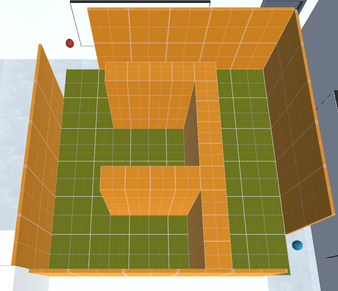||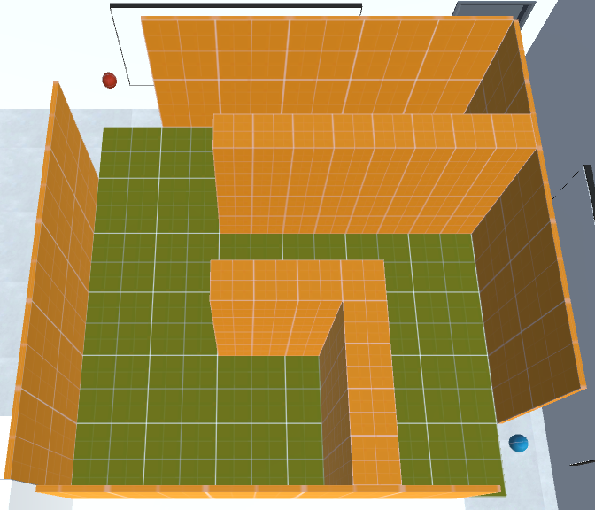|
|7.4 meters|7.3 meters|7.3 meters|

|Variant 4|Variant 5|Variant 6| 
|:-------:|:-------:|:-------:|
|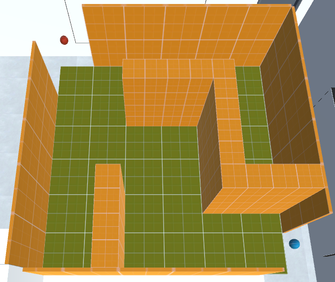|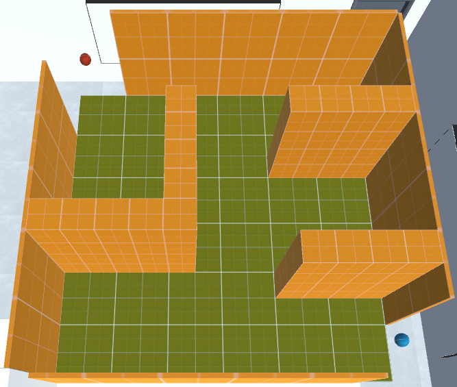||
|6.9 meters|7.3 meters|7.3 meters|

|Variant 7|Variant 8|Variant 9| 
|:-------:|:-------:|:-------:|
|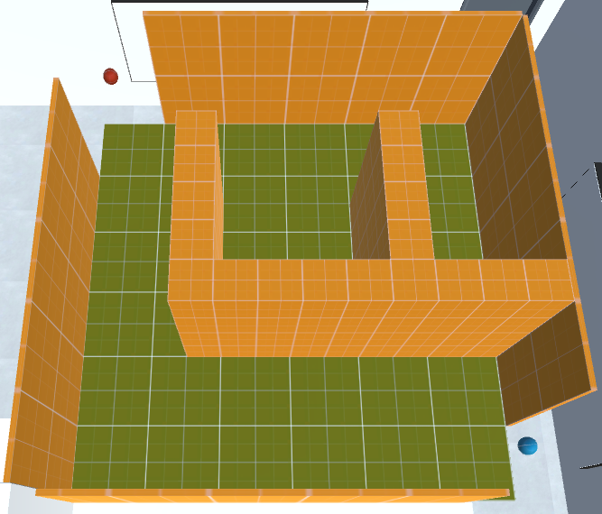|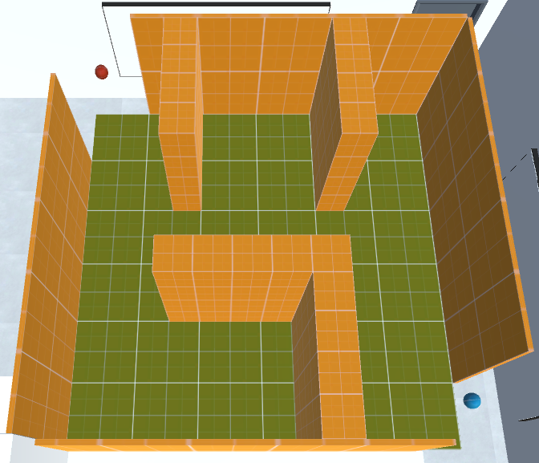|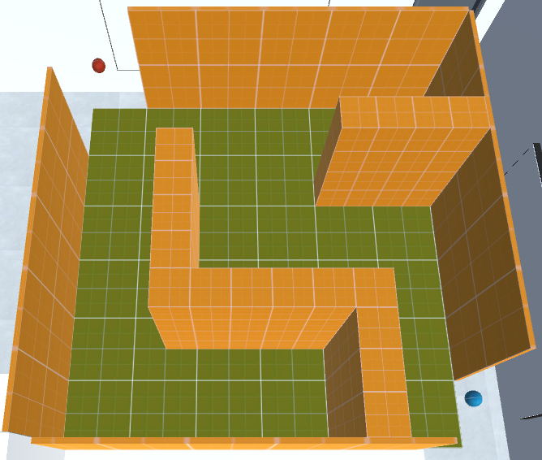|
|7.4 meters|7.3 meters|6.9 meters|

### Hallway
|Variant 1|Variant 2|Variant 3|
|:-------:|:-------:|:-------:|
||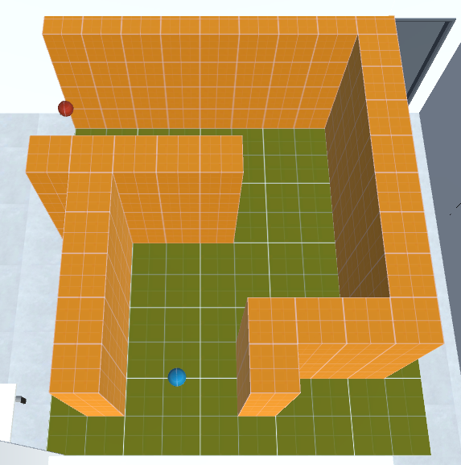|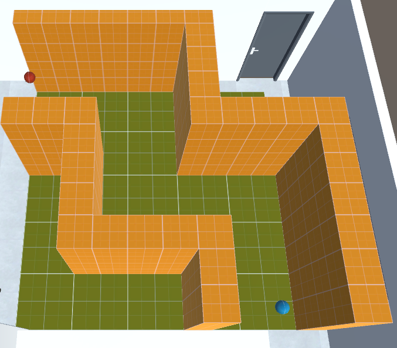|
|6.9 meters|7.0 meters|6.9 meters|

|Variant 4|Variant 5|Variant 6| 
|:-------:|:-------:|:-------:|
|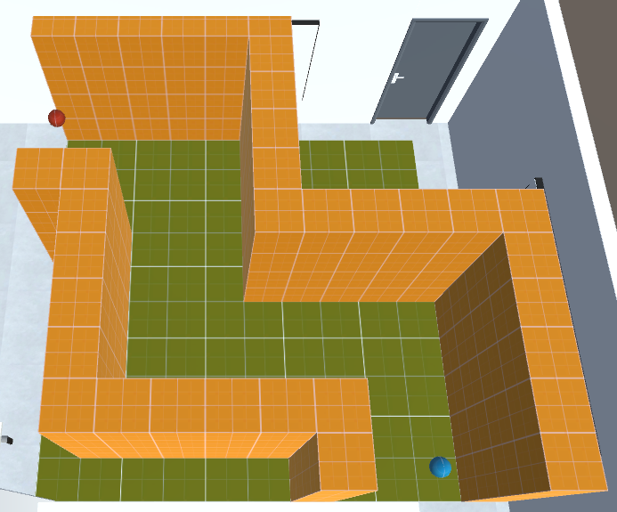|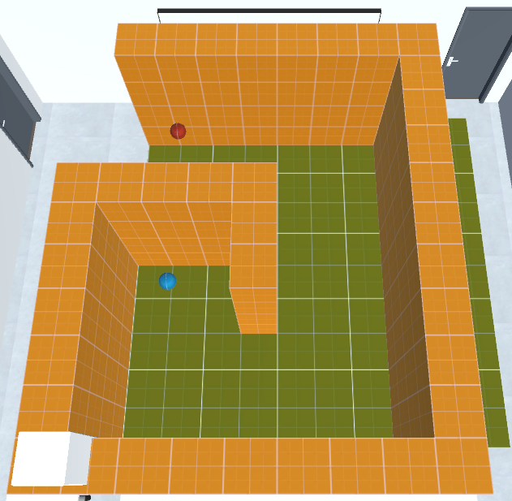|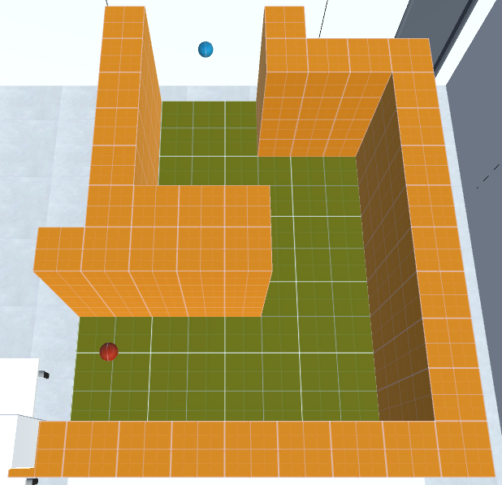|
|6.9 meters|7.0 meters|7.0 meters|

|Variant 7|Variant 8|Variant 9| 
|:-------:|:-------:|:-------:|
||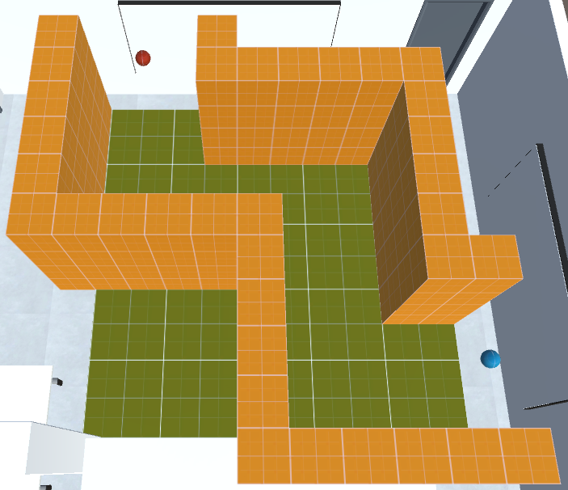||
|7.0 meters|6.9 meters|7.0 meters|

### Pillars
|Variant 1|Variant 2|Variant 3|
|:-------:|:-------:|:-------:|
|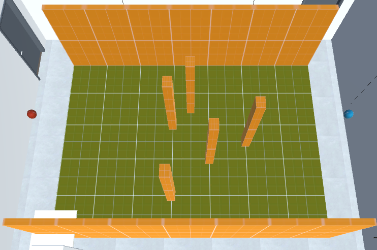|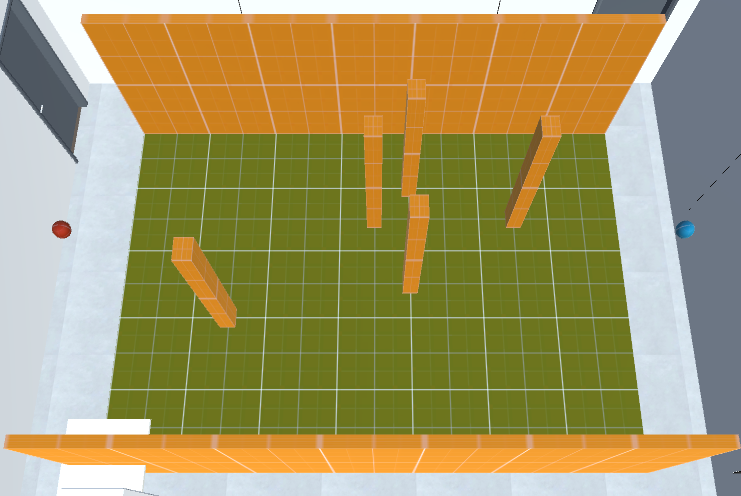||
|6.2 meters|6.1 meters|6.2 meters|

|Variant 4|Variant 5|Variant 6| 
|:-------:|:-------:|:-------:|
|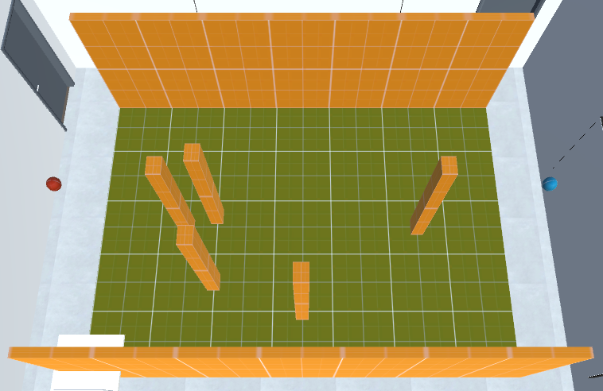|||
|6.2 meters|6.2 meters|6.2 meters|

|Variant 7|Variant 8|Variant 9| 
|:-------:|:-------:|:-------:|
|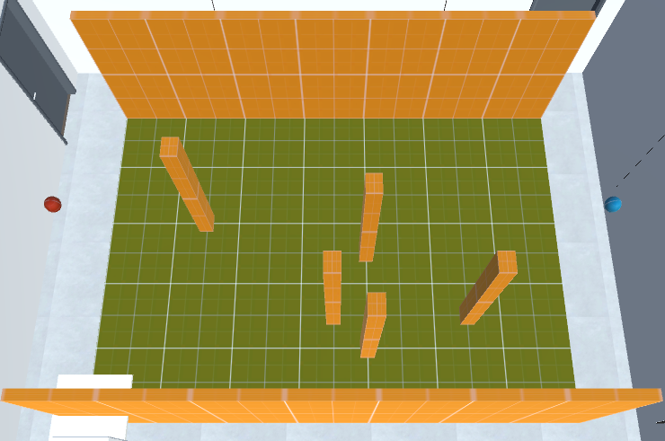|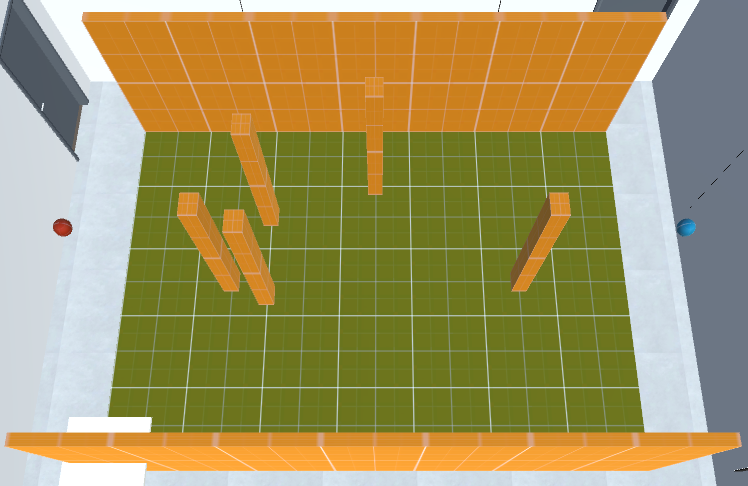|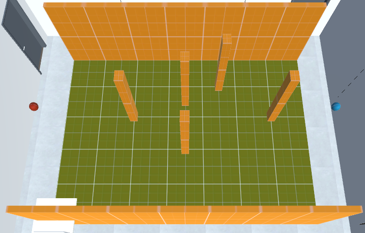|
|6.1 meters|6.2 meters|6.2 meters|

## Project Contents 
### Assets Folder
- **bHaptics** – [Official bHaptics SDK](https://www.bhaptics.com/support/developers/?type=sdk).  
- **Comp-Vibro-Feedback** – Core project folder containing:
  - **Materials** – Black material used for the player avatar's eye visuals.
  - **obj-files-vr-lab** – 3D models of the laboratory environment.
  - **Prefabs** – Reusable obstacle objects.
  - **Scenes** – Main Unity scene for running the experiment.
  - **Scripts** – Experiment logic, feedback systems, sensors, and utilities (detailed below).
  - **Sound Beeps** – Audio cue for trial start and end.
- **Gridbox Prototype Materials** – Third‑party materials from the Unity Asset Store [link](https://assetstore.unity.com/packages/2d/textures-materials/gridbox-prototype-materials-129127?srsltid=AfmBOoqcPSwr5sBgsnd2GTpNhlxB0St-Ofyp_wrep5zygIkb-ATu6SS_) by [SurrealCosmic](https://surrealcosmic.com/). Used for the obstacle and floor visuals.  
- **OptiTrack** – [Official OptiTrack Unity Plugin](https://docs.optitrack.com/plugins/optitrack-unity-plugin).  
- **Plugins** – Standard Unity plugins required for Android builds.  
- **StreamingAssets** – Directory where experiment data is exported.  
- **TextMesh Pro** – [Standard Unity UI text package](https://docs.unity3d.com/Packages/com.unity.textmeshpro@3.2/manual/index.html).  
- **Viveport** – [Official Unity SDK for HTC Vive](https://developer.vive.com/resources/viveport/sdk/documentation/english/viveport-sdk/integration-viveport-sdk/unity-developers/).  
- **XR, XR Interaction Toolkit, and XRI** – Standard Unity XR components.

### Scripts in Assets/Comp-Vibro-Feedback/Scripts
- **ExperimentController.cs** – Manages condition order, environment activation, and trial flow.
- **HapticFeedback.cs** – Central vibrotactile feedback controller; interfaces with all sensors.
- **OptitrackMoment.cs** – Data class storing OptiTrack marker coordinates per timestamp.
- **OptitrackPointCollector.cs** – Collects and logs all active OptiTrack markers. (This data ended up not being used in analysis, as the headset position sufficed.)
- **PathFollowing.cs** – Used for Guidance feedback, calculates direction and distance between the user and the predefined path.
- **PathObject.cs** – Stores a path (series of x,y-points) for each environment variant. Used for Guidance feedback.
- **PlayerMovementPC.cs** – Enables keyboard controls for non‑VR debugging.
- **PlayerTracker.cs** – Logs participant position and orientation throughout each trial.
- **Sensor.cs** – Base class for all sensor implementations.
- **Sensor_Compass.cs** – Computes directional cues for Guidance feedback.
- **Sensor_Directed.cs** – Computes distance-based feedback for handheld pointing.
- **Sensor_Surround.cs** – Detects nearby obstacles for Surround feedback.
- **UI_VestActivation.cs** – Visualizes vest motor activation for debugging and experiment monitoring.
- **VRHandheldCollider.cs** – Tracks collisions involving the handheld controller.
- **VRPlayerBody.cs** – Maintains a physical body proxy (cylinder) used for collision detection. Follows the VR camera 40 cm below and 8 cm behind.

### Scene Hierarchy (Main Scene.unity)
- **bHaptics** – Required bHaptics root object for vest communication.
- **ExperimentController** – Hosts the ExperimentController script. Exposes trial order, timing, and manual override options for debugging.
- **HapticFeedback** – Includes feedback logic and sensor components; allows adjustment of feedback parameters during debugging.
- **Environment** – Contains the laboratory visuals and all environment variants used in the experiment.
- **Canvas** – Provides a UI preview of vest motor activation for experiment monitoring (not visible in VR).
- **XR Interaction Setup** – Holds XR camera, controllers, and related XR components.
- **Client - Optitrack** – Optional component for capturing OptiTrack motion data.

## License
This project is licensed under the Creative Commons Attribution 4.0 International License (CC BY 4.0).

You are free to share and adapt the materials for any purpose, provided that proper credit is given.

For details, see the [LICENSE](LICENSE) file or: https://creativecommons.org/licenses/by/4.0/

This license applies only to the original materials created for this project. Third‑party assets (e.g., Unity packages, SDKs, plugins, or store assets) remain under their respective licenses and are not covered by the CC BY 4.0 license.
